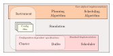

Running experiments with the TopSim CLI
========================================

The primary way to run a TopSim simulation is via the ``topsim experiment``
CLI command. It uses the :py:class:`~topsim.utils.experiment.Experiment`
class to run one or more combinations of planning and scheduling algorithms
against a simulation configuration.

Prerequisites
-------------

You'll need:

* A simulation configuration JSON file generated by **skaworkflows** (or
  written by hand — see the `Workflow format`_ section below for details).
* One or more planning and scheduling algorithm implementations (bundled
  implementations are listed below).

Basic usage
-----------

.. code-block:: bash

    topsim experiment \\
        -i simulations/basic_sim/input/basic_simulation.json \\
        -p topsim.user.plan.batch_planning.BatchPlanning \\
        -s topsim.user.schedule.batch_allocation.BatchProcessing \\
        -d EdgeData \\
        -o ./results \\
        run

This runs a single experiment with the default batch planning and batch
processing algorithms, using edge data for runtime calculations.

Review before running
---------------------

Use the ``describe`` subcommand to see what the experiment will run without
actually executing it:

.. code-block:: bash

    topsim experiment \\
        -i config.json \\
        -p topsim.user.plan.batch_planning.BatchPlanning \\
        -p topsim.user.plan.static_planning.SHADOWPlanning \\
        -s topsim.user.schedule.batch_allocation.BatchProcessing \\
        -s topsim.user.schedule.dynamic_plan.DynamicSchedulingFromPlan \\
        -d NoData \\
        -d EdgeData \\
        -o ./results \\
        describe

Output
------

Results are written to an HDF5 file in the specified output directory,
containing per-timestep simulation state, event summaries, and task-level
timing data.

Running multiple combinations
-----------------------------

The CLI supports running multiple planning and scheduling combinations in
a single invocation by passing the ``-p``, ``-s``, and ``-d`` flags
multiple times. Each combination is paired by position:

.. code-block:: bash

    topsim experiment \\
        -i config.json \\
        -p topsim.user.plan.static_planning.SHADOWPlanning \\
        -p topsim.user.plan.batch_planning.BatchPlanning \\
        -s topsim.user.schedule.dynamic_plan.DynamicSchedulingFromPlan \\
        -s topsim.user.schedule.batch_allocation.BatchProcessing \\
        -d NoData \\
        -d EdgeData \\
        -o ./results \\
        run

This runs four simulations (2 planning × 2 data usage combinations).

Scheduler options
-----------------

Additional scheduler arguments can be passed via the
``scheduler_options`` subcommand:

.. code-block:: bash

    topsim experiment -i config.json -d EdgeData -o ./results \\
        scheduler_options --ignore_ingest --use_workflow_dop \\
        run

Programmatic usage
==================

If you need more control, the :py:class:`~topsim.utils.experiment.Experiment`
class can be used directly in Python:

.. code-block:: python

    from topsim.utils.experiment import Experiment

    exp = Experiment(
        configuration='config.json',
        alloc_combinations=[
            (BatchPlanning, BatchProcessing)
        ],
        data_combinations=[
            {'use_task_data': False, 'use_edge_data': True}
        ],
        output='./results'
    )
    exp.run()

For fully custom setups — such as using a custom Instrument, custom
planning/scheduling logic, or in-memory DataFrame output — use the
:py:class:`~topsim.core.simulation.Simulation` class directly:

.. code-block:: python

    import simpy
    from topsim.core.simulation import Simulation
    from topsim.user.telescope import Telescope
    from topsim.user.plan.batch_planning import BatchPlanning
    from topsim.user.schedule.batch_allocation import BatchProcessing

    env = simpy.Environment()
    simulation = Simulation(
        env=env,
        config='config.json',
        instrument=Telescope,
        planning_model=BatchPlanning('batch'),
        scheduling=BatchProcessing(),
        to_file=False
    )
    global_df, task_df = simulation.start()

Included algorithms
===================

Planning models:
   * :py:class:`~topsim.user.plan.batch_planning.BatchPlanning` —
     topological sort for batch scheduling
   * :py:class:`~topsim.user.plan.static_planning.SHADOWPlanning` —
     HEFT/PHEFT/FCFS via the SHADOW library

Scheduling models:
   * :py:class:`~topsim.user.schedule.batch_allocation.BatchProcessing`
   * :py:class:`~topsim.user.schedule.dynamic_plan.DynamicSchedulingFromPlan`
   * :py:class:`~topsim.user.schedule.greedy.GreedySchedulingFromPlan`
   * :py:class:`~topsim.user.schedule.queue_allocation.QueueProcessing`

Workflow format
===============

Workflows in TopSim are represented as directed acyclic graphs (DAGs)
in JSON format using the `node-link`_ convention:

.. code-block:: json

    {
        "graph": {
            "directed": true,
            "nodes": [
                {"id": "0", "comp": 2, "task_data": 0},
                {"id": "1", "comp": 7, "task_data": 0},
                {"id": "2", "comp": 5, "task_data": 0}
            ],
            "links": [
                {"source": 0, "target": 1, "transfer_data": 10},
                {"source": 0, "target": 2, "transfer_data": 10}
            ]
        }
    }

Node attributes:
    ``id`` — Unique node identifier.
    ``comp`` — Computational demand (FLOPs) for the task.
    ``task_data`` — (optional) Local data size.

Edge attributes:
    ``source``, ``target`` — Predecessor and successor task IDs.
    ``transfer_data`` — Data to transfer between tasks (inter-machine
    communication cost).

Workflow files can be generated using ``skaworkflows`` and are referenced in
the simulation configuration via the ``pipelines[name].workflow`` key.

.. _node-link: https://networkx.org/documentation/stable/reference/readwrite/json_graph.html
