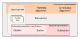

The anatomy of a simulation
===========================

.. currentmodule:: topsim.core

Simulations are started from a :py:class:`simulation.Simulation` object. All
actors that operate within a simulation are instantiated within the

`:py:class:`simulation.Simulation` constructor, and include:

* :py:class:`~instrument.Instrument`
* :py:class:`~scheduler.Scheduler`
* :py:class:`~cluster.Cluster`
* :py:class:`~buffer.Buffer`
* :py:class:`~monitor.Monitor`

Simulation Setup and configuration
-----------------------------------

Cconfiguration files:

* What is in an observation schedule?
* What does a Workflow look like (future work with CWL)
* How do we specify the cluster format
* Bringing it all together (the config object)

------------------------------------
.. code-block:: python

	trace_file = 'sim.trace'
	machines = config.process_machine_config('cluster_config.json')
	observations = config.process_telescope_config('observations.csv')

	# Initialise the simultion environment
	env = simpy.Environment()

	# Set up Actors and Resources
	cluster = Cluster()
	cluster.add_machines(machines)
	algorithm = FifoAlgorithm()
	scheduler = Scheduler(env, algorithm)
	planner = Planner(env, 'heft', 'cluster_config.json')
	buff = Buffer(env)

	max_antennas = 36 # ASKAP
	telescope = Telescope(env, observations, buff, max_arrays, planner)

	# Simulation object activates initial actors and starts the simulation monitoring
	simulation = Simulation(env, telescope, cluster, buff, scheduler, trace_file)
	simulation.init_process()
	env.run()

Instrumental Observation Requirements
--------------------------------------
There are a number of requirements that must be True for an observation to
commence on the telescope:
